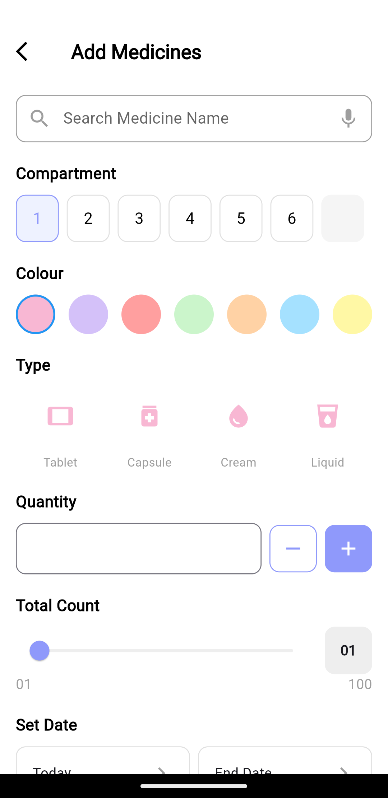
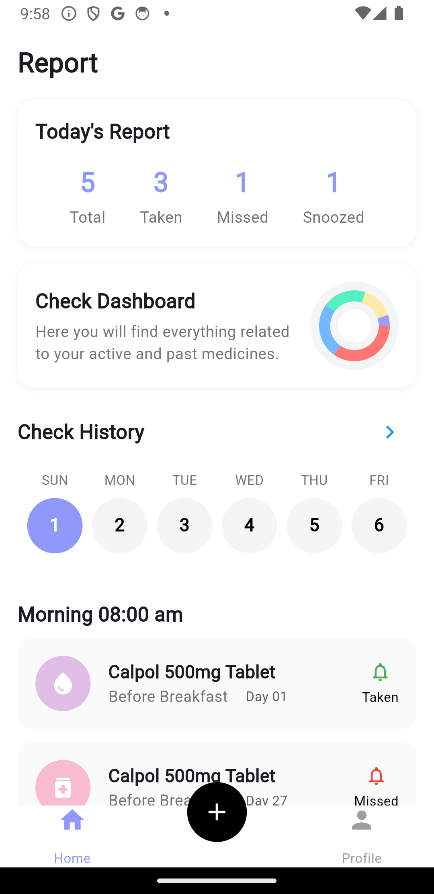
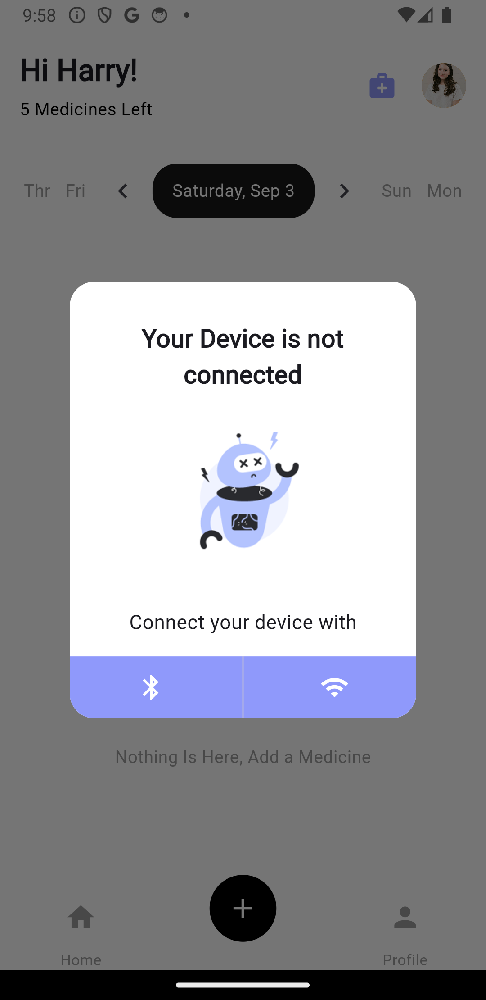
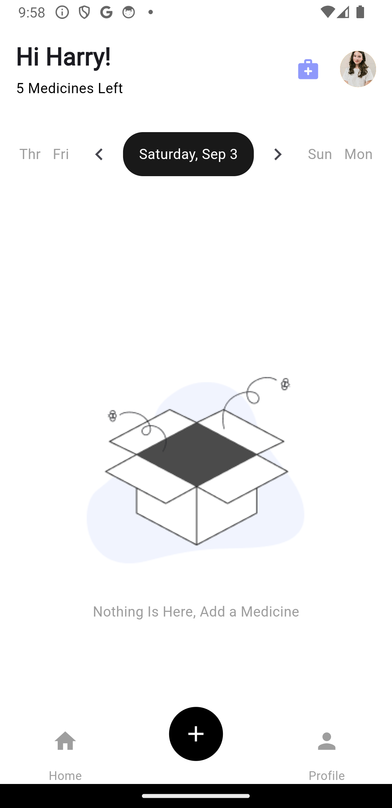
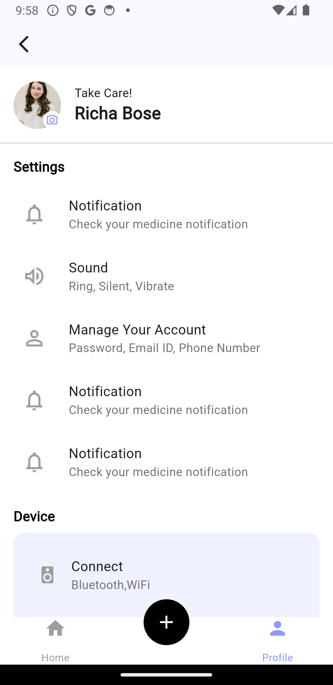
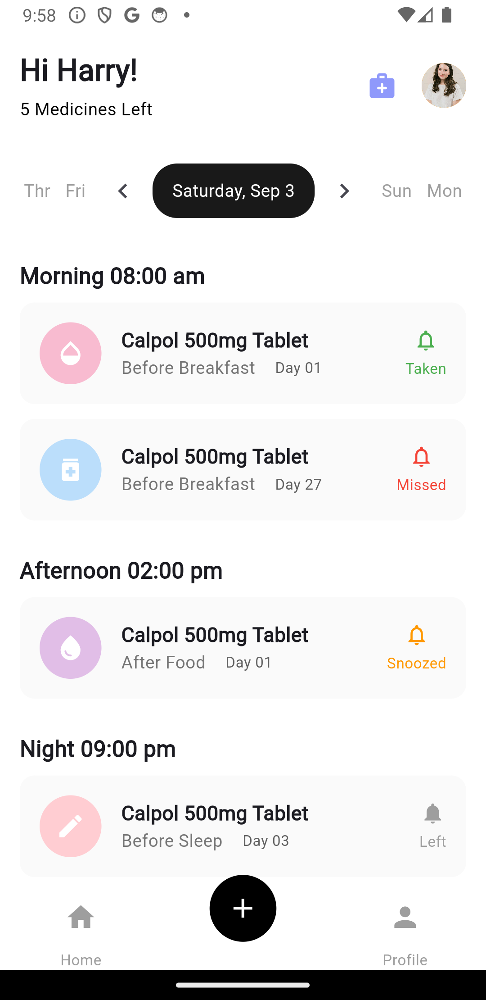
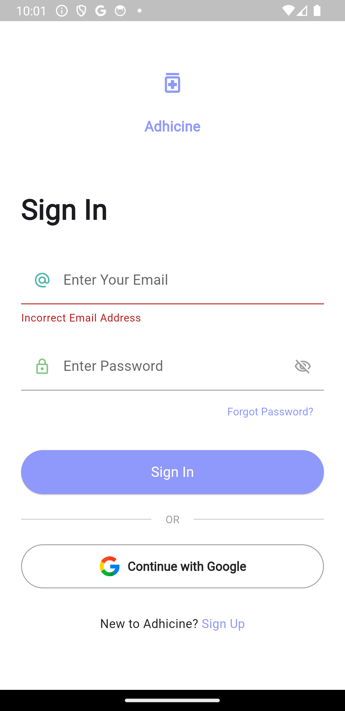
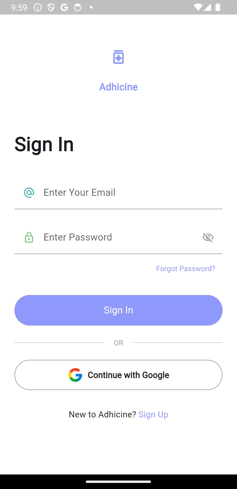

# 🩺 Chikitsa

**Chikitsa** is a medical app built using Flutter. It provides a user-friendly interface for patients to easily access medical resources, appointments, and more.

---

## 🚀 Features

- 🔐 Authentication
- 📅 Appointment Booking
- 📋 Medical Record Management
- 🔔 Notifications

---

## 📸 Screenshots

<div align="center">
  
  
  
  
  <br/>
  
  
  
  
</div>

---

## 🎥 Demo Video

[](https://youtube.com/shorts/b9VZK1VBhmg)

_Click the image above to watch a short demo of Chikitsa_

---

<!-- ## 🛠️ Installation

```bash
# Clone this repository
git clone https://github.com/sayanthmk/chikitsa.git

# Go into the repository
cd chikitsa

# Install dependencies
flutter pub get

# Run the app
flutter run
``` -->

---

## 💻 Technologies Used

- Flutter
- Dart
- Firebase
- Provider State Management

---

## 📝 License

This project is licensed under the MIT License - see the [LICENSE](LICENSE) file for details.

---

## 🤝 Contributing

Contributions, issues, and feature requests are welcome! Feel free to check [issues page](https://github.com/sayanthmk/chikitsa/issues).

---

## 👨‍💻 Author

**Sayanth**

- Github: [@Sayanth](https://github.com/yourusername)
- LinkedIn: [@Sayanth](https://linkedin.com/in/yourprofile)

---

⭐️ If you found this project helpful, please give it a star on GitHub!
